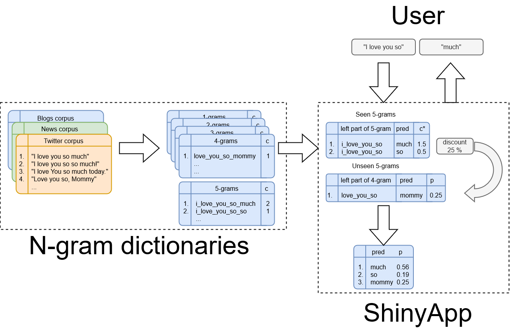
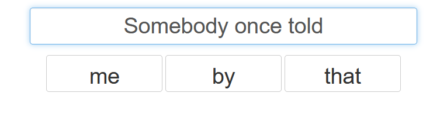

```{r setup, include=FALSE}
knitr::opts_chunk$set(echo = FALSE)
```

## Introduction

* Our application is designed to predict the next word from the text entered by the user

* We are considering the possibility of embedding our application in smart keyboards of mobile devices

* The accuracy of the model used allows us to guess the next word with an accuracy of about 20% (random sample), in addition, the probability that the correct word will be in the top three most likely words is 30% (random sample)

## Application structure

{width=750px}

## Features

* The main feature of the application is the user's ability to choose one of the proposed three words

* The most likely next word is on the left button

* The user can use abbreviations using an apostrophe (I'm, can't, ...)

## User interface

{width=750px}

* Begin typing

* Now you can get a prediction of the next word and press one of the three buttons to insert it automatically

* Try it yourself https://mikhailsukhovey.shinyapps.io/TypeAssistant/
